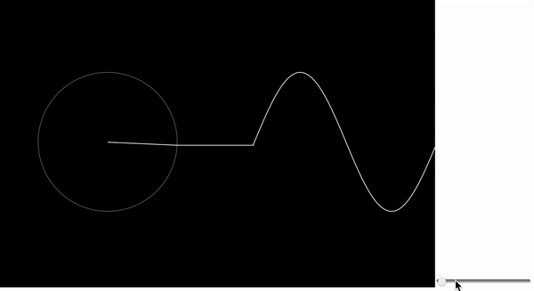

# coding-train
Stuff learned from The Coding Train YouTube channel, starting from Fourier series:

Visualization of square wave generation using just circles and sine waves using [p5.js](https://p5js.org). See [this YouTube video](https://www.youtube.com/watch?v=Mm2eYfj0SgA) by [The Coding Train](https://www.youtube.com/user/shiffman) for more details.

